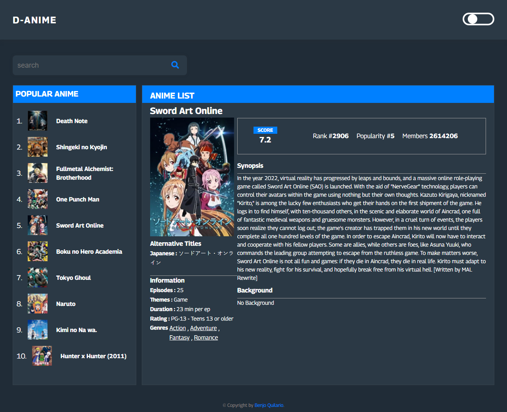

# D-Anime

D-Anime is a vanilla Javascript application that interacts with Jikan API where it can display the information of an anime. This app is built with HTML5, CSS3, JavaScript and Parcel.

### Screenshot

### Links

-  Source Code: [View Source Code](https://github.com/benjoquilario/Portfolio)
-  Live Site URL: [Preview Site](https://d-anime.netlify.app/)

### Built with

-  Semantic HTML5 markup
-  CSS custom properties
-  API(https://api.jikan.moe/v3/)
-  MVC Architecture
-  Parcel
-  Flexbox
-  CSS Grid
-  Mobile-first workflow
-  SCSS

-  LinkedIn - [@benjoquilario](https://www.linkedin.com/in/benjo-quilario-415a351bb/)
-  Twitter - [@iam_benjo](https://twitter.com/iam_benjo)
